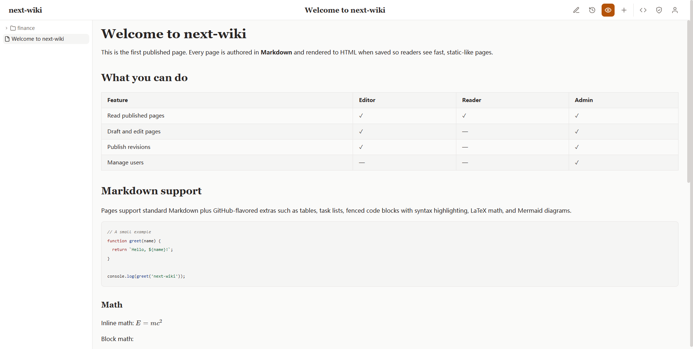
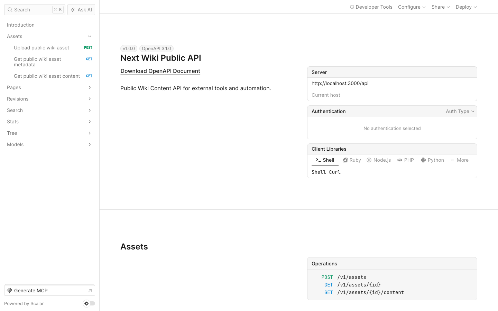
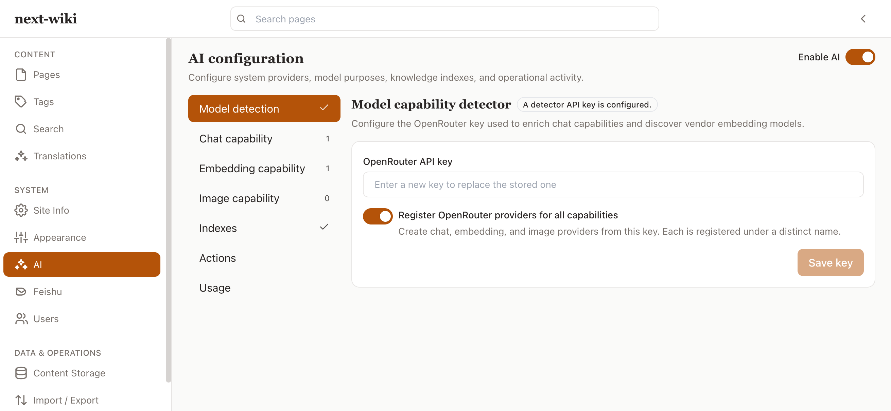

<div align="center">

# next-wiki

**A personal, AI-native knowledge assets vault.**

Write and organize knowledge with AI — and let that same knowledge base become
the grounding memory any AI assistant reads from when it talks with you.
Self-hosted, `docker compose up` simple, and never locked to a single AI vendor.

[](LICENSE)
[](package.json)
[](apps/web/package.json)
[](tsconfig.base.json)

</div>

---

## Screenshots

| Knowledge base home                                  | Public REST API reference                           |
| ---------------------------------------------------- | --------------------------------------------------- |
|  |  |

| AI Native integration                            |
| ------------------------------------------------ |
|  |

## Why next-wiki

- **AI-native creation, never vendor-locked.** A persistent AI chat side pane
  and an [MCP](https://modelcontextprotocol.io) server are the default way to
  draft pages, restructure the page tree, and refine content through dialogue
  — but the manual editor stays fully capable and the wiki never depends on a
  live model connection to be readable, searchable, and editable.
- **Your portable AI memory.** Any MCP-compatible client (Claude, Cursor, or a
  future assistant) can search, read, and write into the same
  permission-scoped store that backs the web UI, so your knowledge outlives
  any single AI vendor.
- **Personal by default.** One `docker compose up` gives a single owner full
  read/write access with zero configuration — no multi-user setup or
  organization concept required to get started.
- **Simple deployment.** PostgreSQL is the only required stateful service.
  Optional features (multi-user sharing, object storage, MCP) never grow the
  default footprint.
- **Everything is versioned.** Every save creates an immutable revision;
  deletion is soft by default; diffs between any two revisions are always
  available.
- **Fast public reading.** Published public documents and navigation use
  static/ISR delivery; login-specific controls hydrate separately, so readers
  do not wait on a session or database query for the document body.
- **Open standards.** A REST + OpenAPI public content API, OAuth2/OIDC for
  federated auth, and Markdown + frontmatter export — no proprietary lock-in
  in the critical path.

## Quick start

Prerequisites: [Docker](https://www.docker.com/) and Docker Compose.

```bash
git clone https://github.com/hugogu/next-wiki.git
cd next-wiki
cp .env.example .env   # edit as needed (registry mirrors, ports, encryption key)
docker compose up -d --build
```

Open [http://localhost:3000](http://localhost:3000) — the app seeds itself on
first run. PostgreSQL is the only required service; everything else (object
storage, alternate content backends) is opt-in via Compose profiles, e.g.
`docker compose --profile storage-s3 up`.

### Optional Feishu integration

An optional [Feishu](https://open.feishu.cn/) integration lets users bind their
Wiki account, ask grounded questions, and receive event notifications from
within Feishu. It is an **in-process module of the web app** — no separate
container, process, or Compose profile — and stays inert until an administrator
configures it, so the default `docker compose up` is unchanged and needs no
Feishu variables.

Configure it entirely in the admin UI at `/admin/feishu`: generate and scan a
Feishu QR code to associate an existing app or create a new one. The App Secret
and short-lived device code are stored encrypted in PostgreSQL and never
returned to the browser or logged. The bot receives events through an outbound
WebSocket long connection, so it needs neither a callback URL nor a public
ingress configuration. Every bot action is attributed to the bound Wiki user
and passes the same permission checks as the web UI.

### Production deployment with Caddy + Cloudflare

For public deployments, run Caddy in front of the `web` service so Cloudflare can
use **Full (strict)** TLS to the origin.

1. Provision a Cloudflare Origin CA certificate for your domain and download the
   certificate (`*.pem` or `*.crt`) and private key (`*.key` or `*.pem`).
2. Place the files in `docker/caddy/certs/`.
3. Edit `.env`:

   ```bash
   # Public domain and app URL
   APP_URL=https://wiki.example.com
   CADDY_HOST=wiki.example.com

   # Match these paths to the filenames you uploaded
   CADDY_CERT_PATH=/etc/caddy/certs/wiki.example.com.crt
   CADDY_KEY_PATH=/etc/caddy/certs/wiki.example.com.key

   # Bind the web container to localhost only; Caddy reaches it through the
   # Docker network. This prevents direct access to port 3000 from the internet.
   WEB_PORT=127.0.0.1:3000
   ```

4. Start the stack with the Caddy overlay:

   ```bash
   # Dev build (builds image locally)
   docker compose -f docker-compose.yml -f docker-compose.caddy.yml up -d --build

   # Prod build (pulls published image, e.g. hugogu/next-wiki-web:latest)
   docker compose -f docker-compose.prod.yml -f docker-compose.caddy.yml up -d
   ```

5. In Cloudflare, set the SSL/TLS encryption mode to **Full (strict)** and point
   the domain's A record to your server IP.

### Local testing with a self-signed certificate

You can test the Caddy overlay locally without Cloudflare by generating a
self-signed certificate.

1. Generate a certificate with SANs for `wiki.local` and `localhost`:

   ```bash
   mkdir -p docker/caddy/certs
   cat > /tmp/localhost.conf <<'EOF'
   [req]
   distinguished_name = req_distinguished_name
   x509_extensions = v3_req
   prompt = no

   [req_distinguished_name]
   CN = wiki.local

   [v3_req]
   keyUsage = keyEncipherment, dataEncipherment
   extendedKeyUsage = serverAuth
   subjectAltName = @alt_names

   [alt_names]
   DNS.1 = wiki.local
   DNS.2 = localhost
   IP.1 = 127.0.0.1
   IP.2 = ::1
   EOF
   openssl req -x509 -nodes -days 365 -newkey rsa:2048 \
     -keyout docker/caddy/certs/localhost.key \
     -out docker/caddy/certs/localhost.crt \
     -config /tmp/localhost.conf
   ```

   The generated key and certificate are ignored by Git.

2. Configure `.env`:

   ```bash
   CADDY_HOST=wiki.local
   CADDY_CERT_PATH=/etc/caddy/certs/localhost.crt
   CADDY_KEY_PATH=/etc/caddy/certs/localhost.key
   CADDY_CERTS_DIR=./docker/caddy/certs

   # Use non-privileged ports if 80/443 are unavailable
   CADDY_HTTP_PORT=8080
   CADDY_HTTPS_PORT=8443
   APP_URL=https://wiki.local:8443
   ```

3. Start the stack with the Caddy overlay:

   ```bash
   docker compose -f docker-compose.yml -f docker-compose.caddy.yml up -d --build
   ```

4. Verify HTTPS and the HTTP→HTTPS redirect:

   ```bash
   curl -k --resolve wiki.local:8443:127.0.0.1 https://wiki.local:8443/healthz
   curl -I --resolve wiki.local:8080:127.0.0.1 http://wiki.local:8080/
   ```

5. Optionally add `wiki.local` to `/etc/hosts` to use a browser:
   ```text
   127.0.0.1 wiki.local
   ```
   Then open `https://wiki.local:8443` and accept the self-signed certificate.

### Local development

```bash
pnpm install
pnpm dev          # turbo run dev, all workspaces
pnpm build        # turbo run build
pnpm lint          # turbo run lint
pnpm typecheck     # turbo run typecheck
pnpm test          # turbo run test
```

Per-app commands live under `apps/web`, e.g. `pnpm --filter @next-wiki/web test:e2e`
for Playwright end-to-end tests. Database migrations use Drizzle:
`pnpm db:generate` / `pnpm db:migrate`.

## Tech stack

Next.js 16 (App Router) · TypeScript 5 · PostgreSQL + Drizzle ORM · pg-boss for
background jobs · a pluggable Markdown rendering pipeline (remark/rehype,
KaTeX, Mermaid) · MCP server for AI clients.

## Project structure

```text
apps/web/                # Next.js app (App Router)
  app/                    # routes (RSC) + REST route handlers under app/api/
  src/server/             # db (Drizzle), services, permissions, pipeline, api
  src/components/         # UI; design-system primitives in src/components/ui/
  messages/               # namespaced next-intl UI catalogs (en/zh JSON)
  src/i18n/               # locale resolver, request config, formats, types
packages/shared/          # zero-dep shared Zod schemas/types
packages/editor/          # editor package
packages/mcp-server/      # @next-wiki/mcp-server — MCP tools for AI clients
specs/                    # Spec Kit feature specs/plans/tasks
docs/                     # architecture docs, plans, reviews
```

## AI integration (MCP)

`@next-wiki/mcp-server` exposes the public wiki content API as MCP tools —
search, read, create, publish, and manage pages from Claude Desktop, Cursor,
or any MCP-compatible client. See
[packages/mcp-server/README.md](packages/mcp-server/README.md) for setup.

## Documentation

- [`docs/architecture`](docs/architecture) — architectural mandates and
  design docs
- [`docs/architecture/mandates.md#search-retrieval-architecture`](docs/architecture/mandates.md#search-retrieval-architecture) — registered, complementary search capability architecture
- [`.specify/memory/constitution.md`](.specify/memory/constitution.md) —
  binding project principles
- [`specs/`](specs) — feature specs, plans, and tasks (Spec Kit workflow)

## Contributing

Issues and pull requests are welcome. Please keep changes focused, follow the
existing code conventions, and add tests for new behavior.

## License

Licensed under the [Apache License, Version 2.0](LICENSE).
