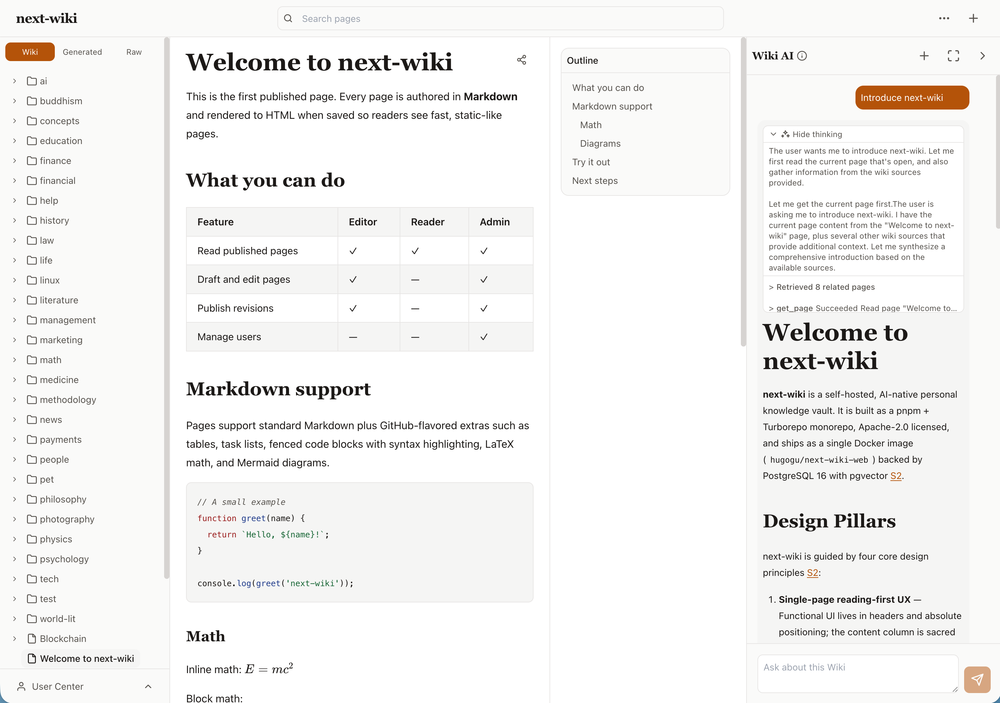
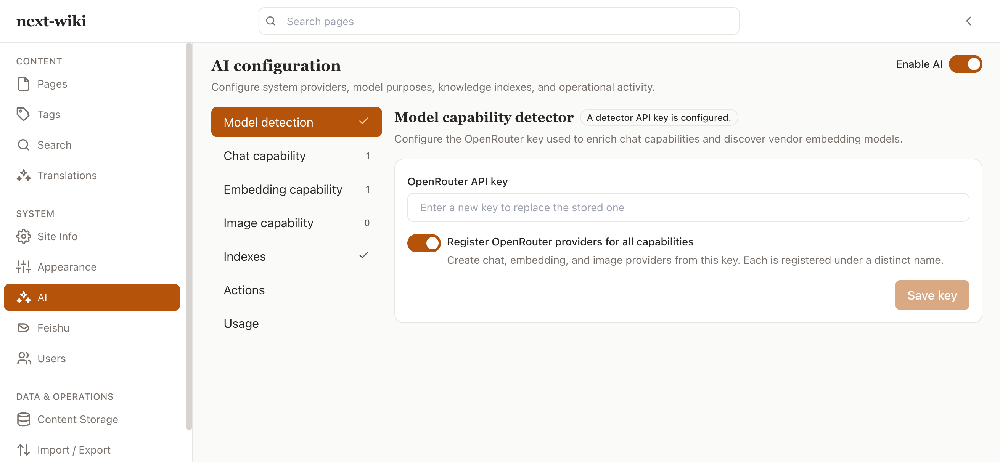
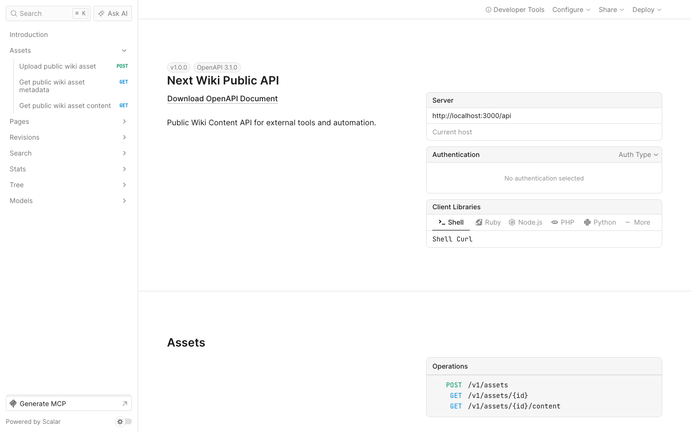
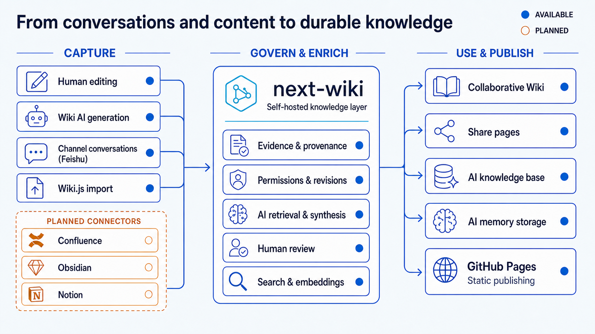
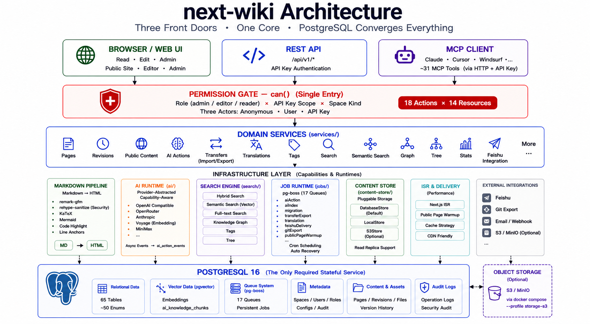

<div align="center">

# next-wiki

**A self-hosted, AI-native wiki for turning conversations and sources into durable knowledge.**

Capture what you learn, keep the evidence, ask AI to retrieve and organize it,
and publish a readable wiki when it is ready. next-wiki is built for people who
want an AI memory they can run, inspect, export, and connect to any compatible
client.

[](LICENSE)
[](package.json)
[](apps/web/package.json)
[](tsconfig.base.json)
[](docker-compose.yml)
[](https://next-wiki.hugogu.cn/)

</div>

> GitHub strips `<iframe>`/`<script>` tags from rendered READMEs, so this page
> can only link out rather than embed the demo inline. The
> [project home page](https://next-wiki.hugogu.cn/) embeds a real, live
> instance you can click through — not a recorded walkthrough — running in
> read-only demo mode (see [`NEXT_WIKI_DEMO_READONLY`](docs/deployment.md#public-read-only-demo)).

> **Project status:** next-wiki is actively developed and currently in an
> early open-source release. Interfaces and configuration may evolve.



| AI administration | Public REST API reference |
| --- | --- |
|  |  |

## From capture to durable knowledge



Solid blue represents capabilities available today. Amber dashed cards represent
planned import connectors. The editable source and regeneration instructions
live in [the diagram source](docs/diagrams/knowledge-flow.md).

## Why next-wiki?

Most wikis are good at storing pages, while most AI assistants are good at
answering questions. next-wiki joins the two into a governed knowledge loop:

```text
conversation / source / command output
              │
              ▼
       raw, append-only evidence
              │
              ▼
    AI retrieval, synthesis, and drafts
              │
              ▼
       human review and publication
              │
              ▼
       durable, searchable wiki memory
```

The goal is not to hide an AI agent behind a chat box. The goal is to make
knowledge useful to both people and agents while keeping ownership, evidence,
permissions, revisions, and publication boundaries visible.

## Highlights

### A complete Markdown wiki

- Edit Markdown with a split source/preview editor and a familiar page tree.
- Render GitHub-Flavored Markdown, syntax-highlighted code, math with KaTeX,
  Mermaid diagrams, images, frontmatter, tags, and metadata.
- Save drafts, publish explicit revisions, compare any two revisions, and
  soft-delete pages without losing their history.
- Navigate backlinks, outbound links, page neighborhoods, tags, and related
  content from the reader.
- Export page Markdown directly, or use the versioned ZIP transfer flow for
  published pages and referenced local images.

### AI that can read, reason, and help curate

- Persistent Wiki AI chat is grounded in the wiki through hybrid keyword and
  semantic retrieval, with visible sources and retrievable citations.
- Chat sessions are retained, shareable through their URL, and restorable with
  their conversation context.
- Configure chat, embedding, and image capabilities independently. The admin
  surface manages providers, models, capability detection, assignments,
  prompts, runtime parameters, usage, and vector index rebuilds.
- Use AI for page drafting, text improvement, image generation, and queued
  multilingual translation workflows with immutable provenance.
- When a selected model cannot use tools, Wiki AI degrades to ordinary
  question answering instead of silently pretending it performed a mutation.

### A governed Wiki AI tool runtime

Wiki AI can use a built-in, MCP-compatible `next-wiki` tool provider to work
with the same permission-checked services used by the web UI and REST API.
The runtime provides:

- read tools for search, page retrieval, page listing, tags, backlinks, and
  page neighborhoods;
- draft and organization tools for creating/saving page drafts, changing
  metadata and properties, managing tags, and proposing batch operations;
- a bounded, provider-agnostic tool loop with live tool-call status in chat;
- server-enforced risk, permission, retention, and review policies;
- Admin proposal review with approve, reject, apply, conflict detection, and
  per-item results;
- Tool Evidence Raw entries when tool output becomes durable source material;
- audit events and normal page revision/publication boundaries for durable
  changes.

Only the built-in wiki provider is enabled inside Wiki AI today. External MCP
providers are intentionally not auto-discovered or activated in this phase.
The separately packaged MCP server is available when an external AI client
should connect to next-wiki directly.

### A self-growing memory model

Choose the authoring model that fits the instance:

| Mode | Best for | Content model |
| --- | --- | --- |
| **Copilot** | A conventional collaborative wiki | Human and AI work in the default wiki space; drafts and publication remain the primary workflow. |
| **LLM Wiki** | Evidence-first personal or team memory | `raw` stores append-only source material, `generated` stores AI-produced concepts with provenance, and `default` remains the curated public wiki. |

In LLM Wiki mode, raw entries can preserve extracted text together with
original bytes such as PDF, HTML, JSON, images, and logs. Generated concepts
can be published into the public tree through a soft link, without copying the
knowledge away from its source. Raw and generated spaces have independent
visibility controls and remain permission-scoped.

### Self-hosted and portable by design

- The default deployment is one web container plus PostgreSQL 16 with
  pgvector; background jobs run through the existing PostgreSQL-backed pg-boss
  setup.
- PostgreSQL is the default content store. Local filesystem and S3-compatible
  content backends are available when binary or Markdown content should live
  outside the database.
- Published content can be synchronized one-way to a Git repository, with
  scheduled reconciliation and automatic sync on publish.
- The public content API is documented with OpenAPI and exposes search, page
  CRUD, revisions, publishing, links, graph queries, tags, assets, batch
  operations, and health statistics.
- API keys are scoped, encrypted at rest, and audited. Web, API, MCP, and
  Feishu actions resolve through the same permission model.
- English and Chinese UI catalogs are included, with user-level appearance and
  reading-theme preferences.

## Quick start with Docker

Prerequisites: [Docker](https://docs.docker.com/get-docker/) with Docker
Compose.

```bash
git clone https://github.com/hugogu/next-wiki.git
cd next-wiki
cp .env.example .env
docker compose up -d --build
```

Open [http://localhost:3000](http://localhost:3000) — a fresh instance has no
admin yet, so it redirects straight to the guided `/setup` flow to create the
first Admin account and, optionally, generate example pages.

Or, for a one-command version that also waits for startup and opens the
browser for you:

```bash
pnpm install && pnpm quickstart
```

This is the same Docker Compose stack above — `.env` is optional since every
variable has a working default — just with progress feedback and an
auto-opened tab once the app is healthy.

The default stack only requires PostgreSQL. To experiment with the optional
S3-compatible content backend, start MinIO with the Compose profile:

```bash
docker compose --profile storage-s3 up -d --build
```

For production image deployment, TLS, automated deployment, and backups, see
the [production deployment guide](docs/deployment.md). A Caddy overlay is
provided for deployments using Cloudflare Full (strict) TLS.

## Configure AI

AI is optional: the wiki remains readable, searchable, editable, and
exportable without a configured model. After setup, an Admin can open
**Admin → AI** to:

1. add provider connections and synchronize available models;
2. map models to Wiki text, Wiki embedding, and Wiki image capabilities;
3. enable semantic search by building an embedding index;
4. tune Wiki AI prompts and runtime parameters;
5. configure the **Tools** policy surface and proposal review workflow;
6. manage **Skills** — reusable, file-based procedures the assistant follows for
   recurring wiki tasks.

### Skills

next-wiki ships with three skills — **Wiki Writer** (draft and expand pages),
**Wiki Tagger** (propose tags and metadata), and **Wiki Linker** (turn keywords
that already have wiki pages into links). They are enabled by default and need
no configuration.

A skill is instructions, not authority: it tells the assistant *how* to approach
a task, while what it may actually do is still decided by the requesting user's
permissions and the review policy. Changes still land as drafts or reviewable
proposals.

Skills reach the model by name and one-line description; the full instructions
are loaded on demand, so a large library does not tax every conversation.

Administrators can browse and edit every file in a skill from
**Admin → AI → Skills**, including its reference scripts. **Scripts are
reference material: next-wiki never executes them.**

To use skills installed on the host, mount a directory of skill packages:

```bash
# .env
SKILLS_HOST_PATH=./.skills
SKILLS_BASE_PATH=/data/skills
```

Compose mounts it read-only. The service never writes there, so edits made in
the admin UI are stored in PostgreSQL and are **not** written back to the host —
change host skills on the host, then use **Rescan directory**. A package that
fails to load never stops the others or the service; it is listed under *Not
loaded* with the specific reason.

A skill package is the published Anthropic layout — a directory containing a
`SKILL.md` whose YAML frontmatter declares `name` and `description` — so skills
written for other Claude-based tools load unchanged. Names must be unique across
every source; a duplicate is reported rather than silently shadowing.

The provider registry includes OpenAI-compatible providers, OpenRouter,
Anthropic, Kimi, Z.ai, Voyage AI, MiniMax image generation, and custom
OpenAI-compatible endpoints where the capability is supported. A global
`OPENROUTER_API_KEY` may be supplied in `.env`; provider credentials entered
through Admin AI are stored server-side and are not returned to the browser.

## Feishu integration

Feishu is an optional in-process integration; it adds no container, worker, or
Compose profile. An Admin configures it from `/admin/feishu` by scanning the
native Feishu QR flow to associate an existing app or create one.

The bot uses an outbound WebSocket long connection, so it does not require a
callback URL, public ingress, or manually copied App Secret. Credentials and
short-lived device codes are encrypted in PostgreSQL. After users bind their
Wiki identity, Feishu questions and tool-enabled turns are attributed to that
user and pass the same permission checks as the web UI.

## API and MCP integrations

### REST + OpenAPI

Open the interactive API reference at
[`/api-docs`](http://localhost:3000/api-docs). The public OpenAPI document is
served at [`/api/public-openapi.json`](http://localhost:3000/api/public-openapi.json)
and the complete document at `/api/openapi.json`.

The versioned API base is `/api/v1`. Create an API key from **User Center → API
Keys**, then use it with the API:

```bash
curl \
  -H "Authorization: Bearer nwk_your_api_key" \
  http://localhost:3000/api/v1/pages?limit=20
```

API keys combine the owner's role with explicit scopes, so a key cannot grant
more access than its owner. API activity is recorded in the audit log.

### MCP server for external AI clients

The [`@next-wiki/mcp-server`](packages/mcp-server/README.md) package connects
Claude Code, Cursor, OpenCode, OpenClaw, and other MCP-compatible clients to
the same API. It supports retrieval, page authoring, drafts and publishing,
revision history and diffs, links and graph navigation, tags, raw evidence,
batch operations, assets, and wiki health checks.

Install it with:

```bash
npx -y @next-wiki/mcp-server
```

Configure `NEXT_WIKI_API_URL` (for example,
`http://localhost:3000/api/v1`) and `NEXT_WIKI_API_KEY`. See the
[MCP server guide](packages/mcp-server/README.md) for client-specific
configuration and LLM Wiki memory conventions.

### Hermes memory provider

The [`next-wiki-hermes-memory`](packages/hermes-memory-provider/README.md)
Python package is the first client of the generic Agent Memory backend (a native
Hermes `MemoryProvider`, not an MCP wrapper). It creates a dedicated,
server-enforced memory destination and `agent_identity` binding for each key and
exposes safe recall, save, and forget tools. Memory is stored as immutable,
restricted Raw entries through the shared page/revision/content-store and index
pipeline; forgetting changes only the Agent Memory recall projection. Automatic
conversation capture is deliberately off by default and must be enabled in the
provider profile after setup. See the
[Hermes memory provider guide](packages/hermes-memory-provider/README.md) for key
creation, installation, capture/checkpoint policy, and reverse-proxy guidance.

### OpenClaw Memory Wiki plugin

The [`@next-wiki/openclaw-memory-wiki`](packages/openclaw-memory-wiki/README.md)
native plugin mirrors the local OpenClaw Memory Wiki vault into the same
account-bound Agent Memory + Raw/page/revision pipeline and bundles a
`next-wiki` retrieval Skill. Provision a normal **Memory provider** API key
from **User Center → API Keys**, set its `agentIdentity` to `openclaw`, and
combine `memory.read`/`memory.write` with `view` and any administrator-approved
space grants as needed. Keep the one secret in an OpenClaw SecretRef. The
plugin and Hermes adapter use the same server-side memory/page model; they
only differ in their client runtime and source format.

## Content import, export, and storage

Admin transfer tools support:

- versioned ZIP export of published pages, frontmatter, and referenced assets;
- safe archive import with preview, validation, size/entry limits, and cleanup;
- Wiki.js source discovery, preview, conversion, and import;
- pause, resume, cancel, retry, and item-level transfer status.

See [content import and export](docs/content-import-export.md) for archive
details and recovery behavior.

The storage admin surface can switch between PostgreSQL, local content storage,
and S3-compatible storage through a migration workflow. A Git export backend
provides one-way synchronization of the published snapshot; Git is not used as
a read source.

## Architecture



next-wiki is a pnpm workspace and Turborepo monorepo:

```text
apps/web/                # Next.js 16 App Router application
  app/                    # pages, route handlers, API and health endpoints
  src/server/             # Drizzle schema, services, permissions, AI and jobs
  src/components/         # UI, editor, chat, admin and design primitives
  messages/               # English and Chinese UI catalogs
packages/shared/          # shared Zod contracts and TypeScript types
packages/mcp-server/      # published MCP adapter for AI clients
specs/                    # Spec Kit feature specifications and plans
docs/                     # architecture, deployment and feature documentation
```

Important design boundaries:

- AI actions and long-running work use the PostgreSQL-backed async job
  lifecycle rather than blocking request handlers.
- Tool execution reuses permission-checked services and re-checks permissions
  when a proposal is reviewed or applied.
- Page content is versioned; public content changes go through the normal
  draft/revision/publication and cache-invalidation path.
- Raw evidence is the source layer for durable AI memory; indexes, summaries,
  and retrieval projections are rebuildable.
- Public reading is optimized for static/ISR delivery, while session-specific
  controls hydrate separately.

## Local development

Use Docker Compose for PostgreSQL, then run the monorepo locally:

```bash
docker compose up -d db
pnpm install
pnpm dev
```

Common checks:

```bash
pnpm build
pnpm lint
pnpm typecheck
pnpm test

# Web end-to-end tests (requires a dedicated test database)
pnpm --filter @next-wiki/web test:e2e

# Database schema and migrations
pnpm db:generate
pnpm db:migrate
```

Database migrations are generated from the Drizzle schema; do not hand-author
SQL migration files. See the package READMEs and the
[architecture documentation](docs/architecture) for more focused guidance.

## Documentation

- [Production deployment](docs/deployment.md)
- [Content import and export](docs/content-import-export.md)
- [Architecture](docs/architecture)
- [MCP server guide](packages/mcp-server/README.md)
- [Feature specifications and plans](specs)
- [Project constitution](.specify/memory/constitution.md)

## Contributing

Issues, documentation improvements, tests, and focused pull requests are
welcome. Before opening a change:

1. search for an existing service, shared contract, or UI primitive to reuse;
2. keep the change focused and follow the existing TypeScript/React patterns;
3. add or update unit, integration, and end-to-end coverage as appropriate;
4. run the relevant lint, typecheck, and test commands;
5. update the matching API or feature documentation when behavior changes.

## License

Licensed under the [Apache License, Version 2.0](LICENSE).
