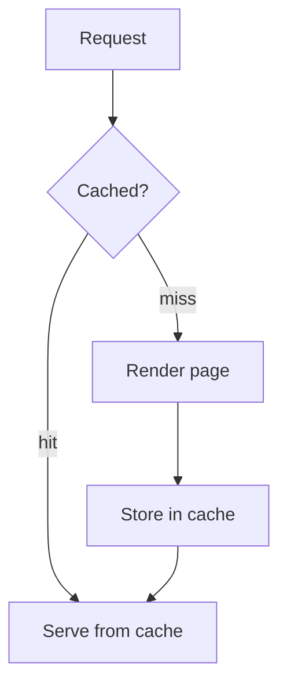

# Syntax this wiki actually renders

Reference material for the Wiki Writer skill. Every rule here is about *this*
wiki's rendering pipeline. Syntax that another wiki supports is not listed
because writing it here produces a broken page, not a nicer one.

## Diagrams: Mermaid

Fenced ` ```mermaid ` blocks are rendered as diagrams, and readers can zoom
them.

````markdown

````

Mermaid covers flowcharts (`graph`), sequence diagrams (`sequenceDiagram`),
class diagrams (`classDiagram`), state diagrams (`stateDiagram-v2`), ER
diagrams (`erDiagram`), and Gantt charts.

**PlantUML is not rendered here.** A ` ```plantuml ` block shows up as a wall of
unhighlighted source. If you want a class or sequence diagram, use Mermaid's
`classDiagram` or `sequenceDiagram`.

**Never draw with text characters.** ASCII art, box-drawing characters, and
columns of aligned pipes all break on narrow screens, are unreadable to screen
readers, and cannot be searched. If it is a diagram, it is Mermaid; if it is
tabular, it is a table.

## Maths: KaTeX

Inline maths in `$…$`, display maths in `$$…$$`.

```markdown
The gradient step is $\theta_{t+1} = \theta_t - \eta \nabla L(\theta_t)$.

$$
\mathrm{KL}(P \parallel Q) = \sum_i P(i) \log \frac{P(i)}{Q(i)}
$$
```

Rules, each because breaking it fails silently or ugly:

- **Put `$$` delimiters on their own lines** for anything multi-line. A block
  written as `$$\begin{bmatrix}` … `\end{bmatrix}$$` loses its first line.
- **Never `\[…\]` or `\(…\)`.** They are not recognised and render as literal
  backslashes and brackets.
- **Never wrap maths in a code fence or backticks.** It will render as source
  instead of as maths.
- **Put a space after a command**: `\alpha x`, not `\alphax`.
- **Use LaTeX, not Unicode symbols**: `\to` rather than `→`, `\leq` rather
  than `≤`.

### Real maths earns a free plot

This wiki offers an interactive plot for any single-variable function or simple
x–y relation written as real maths — polynomials, fractions, roots, trig, exp,
log, and shapes like a circle. `$y = x^2 - 3x + 2$` becomes something the reader
can pan and zoom.

That only works if you write it as maths. The same expression inside a code
fence is just text. It is one more reason never to put formulas in backticks.

## Tables

GFM tables render. Use one whenever you are comparing more than two things
along more than one dimension — a table is read at a glance where the
equivalent prose is not read at all.

```markdown
| Backend | Extra service | Survives restart | Good for |
|---|---|---|---|
| PostgreSQL | none | yes | the default |
| Local disk | none | yes | large assets on one host |
| S3 | object storage | yes | multi-host deployments |
```

Give a units row or say the units in the header. A column of bare numbers is a
guessing game.

## Code

Always tag the language — it drives syntax highlighting.

````markdown
```ts
export function slugify(title: string): string {
  return title.toLowerCase().replace(/[^a-z0-9]+/g, '-');
}
```
````

Use `text` for output, logs, and anything with no language.

## Images

Standard Markdown: ``.

- **Alt text is not optional.** It is what a screen reader and a failed load
  both fall back to. Describe what the image shows, not "image".
- **Place an image after the section it illustrates**, not before it, and
  follow it with a sentence saying what the reader should notice in it.
- **Never invent a URL.** An image you did not either find on the page or
  create through the tools below is a broken image, which is worse than none.

### Generating an illustration

Three separate calls, in order. Nothing is added to the page until the last
one, and no tool here publishes anything.

1. **`generate_image`** — needs `pageId`, `revisionId` (both returned by
   `get_page`), and a `source`:
   - `{ "kind": "page" }` illustrates the page as a whole;
   - `{ "kind": "selection", "text": "…" }` illustrates one unique passage,
     copied verbatim from that revision. Do not provide a hash: the server
     validates the selection against the revision and computes one itself.

   Optionally `aspectRatio`: `1:1`, `2:3`, `3:2`, `3:4`, `4:3`, `4:5`, `5:4`,
   `9:16`, `16:9`, `21:9`. Prefer `16:9` for a wide diagram-like illustration
   and `4:3` for a scene.

   The prompt is derived from the page content — there is no free-text prompt
   argument. To steer the image, select the passage that describes what you
   want drawn rather than trying to describe it separately.

2. **`insert_generated_images`** — after all images have been generated from
   the same current revision, pass its `pageId`, `revisionId`, and each
   `artifactId` with descriptive `altText`. It promotes the artifacts and
   inserts them after their source selections in one draft without serializing
   or rewriting the existing Markdown. If an image was generated from the
   whole page (or is a legacy artifact), supply that image an `afterText` value:
   a unique literal passage from the same revision after which it should go.

**Use descriptive alt text.** Pass a real description of what the picture
shows as `altText`; every other rule about alt text applies to generated images
too.

### When to generate one, and when not to

Generate an illustration when a picture carries information prose cannot: a
scene, a physical object, an artistic or historical subject.

Do not generate one for anything with structure — architectures, flows,
relations, timelines, comparisons. Those want a Mermaid diagram or a table,
which stays accurate, searchable, and legible at any width. A generated picture
of a system diagram looks plausible and says nothing.

One illustration per major section at most. A generated image that merely
decorates costs the reader load time and attention for nothing.

## Links

- Internal: the target page's own path, e.g. `[backup policy](guides/backup-policy)`.
  A leading slash is fine and is ignored.
- External: the full URL.
- Never leave a bare URL in prose where a titled link would read better.

## Headings

- Exactly one H1, at the top.
- Never skip a level — no H2 followed by H4.
- Headings are anchors people link to. Renaming one breaks those links, so
  rename only when the old heading is actually wrong.
