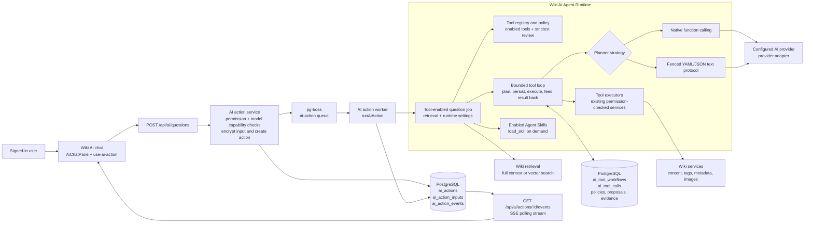
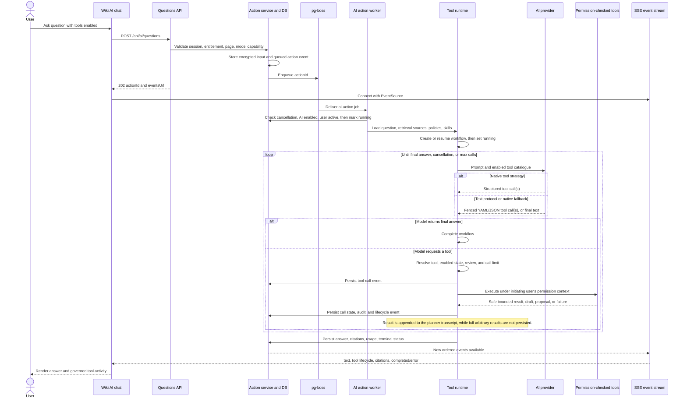

# Agent Runtime

This document describes the implemented Wiki AI Agent Runtime: the tool-enabled branch of the `wiki_question` action. It is a durable, permission-scoped, bounded tool-calling workflow, rather than a separate always-on autonomous agent service.

Ordinary Wiki AI questions use the same action, queue, provider, retrieval, event, and retention foundations, but stream a single answer without entering the tool loop.

## Architecture

Key boundaries:

- The request handler only validates input, creates an `ai_action`, encrypts the turn payload, and enqueues its ID. It returns `202 Accepted`; it does not call an AI provider synchronously.
- The pg-boss worker registers feature handlers at boot and dispatches the action. A restart re-enqueues recoverable actions.
- The runtime offers only policy-enabled tools to the planner. It resolves the effective review decision on the server, under the initiating user's `PermCtx`; a model cannot expand the user's permissions or weaken review.
- Tool executors reuse existing application services. Reads return bounded model-facing results; writes produce drafts, proposals, or audited immediate mutations according to the effective policy.
- The UI consumes the durable action-event log through SSE. The stream can reconnect using its last event ID, so it is not coupled to one HTTP request.

## Tool-enabled turn lifecycle

## Guardrails and terminal paths

The loop runs sequentially and is capped by `maxCalls` from the provider default policy or runtime setting. Each call is recorded before execution. Unknown or disabled tools are recorded as `blocked`; failed tools are returned to the model as safe failure text; successful results are truncated before they are appended to the next planning prompt.

The workflow reaches `completed` when the planner emits a final answer, `limit_reached` when another call would exceed its cap, and `cancelled` when the durable action cancellation flag is observed. Provider failures mark the workflow failed (or cancelled) and the outer action handler records the final error state. pg-boss retry behavior applies only to retryable normalized provider failures.

The durable record intentionally separates concerns:

| Record | Purpose |
| --- | --- |
| `ai_actions` / `ai_action_inputs` | Request lifecycle and encrypted input retained for the configured event window. |
| `ai_action_events` | Ordered, permission-checked event source for streaming and session reconstruction. |
| `ai_tool_workflows` / `ai_tool_calls` | State machine and bounded audit trail for each tool-enabled turn. |
| Tool proposals and evidence links | Reviewable non-page mutations and provenance that may outlive action cleanup. |

## Relevant implementation entry points

- `apps/web/app/api/ai/questions/route.ts` — accepts questions and selects the tool-enabled path when requested.
- `apps/web/src/server/services/ai-actions.ts` — durable action creation, queueing, event persistence, cancellation, and cleanup behavior.
- `apps/web/src/server/jobs/register.ts` and `apps/web/src/server/jobs/ai-actions.ts` — worker registration and feature dispatch.
- `apps/web/src/server/jobs/ai-question.ts` — retrieval, planner strategy, workflow setup, final answer, citations, and usage persistence.
- `apps/web/src/server/services/ai-tool-runtime.ts` — workflow/call state transitions and the bounded execution loop.
- `apps/web/src/server/services/ai-tool-policy.ts` and `apps/web/src/server/services/ai-tool-executors.ts` — policy enforcement and permission-scoped execution.
