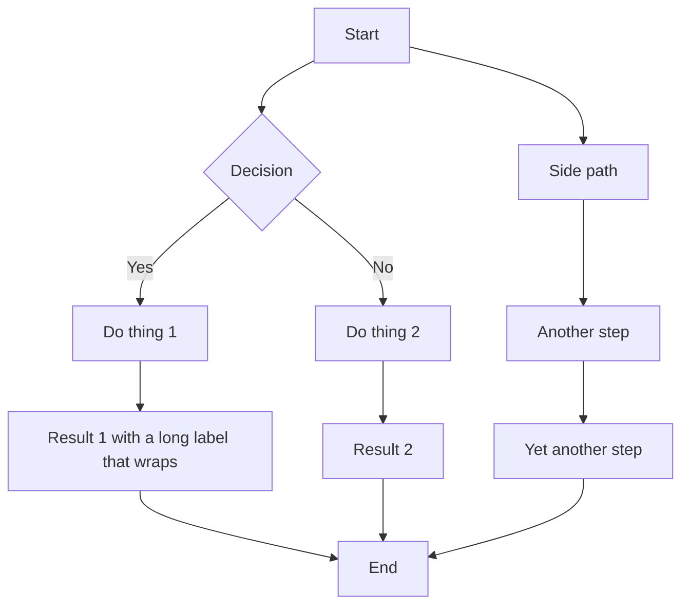

# Mermaid Diagram Zoom Popup Implementation Plan

> **For Claude:** REQUIRED SUB-SKILL: Use superpowers:executing-plans to implement this plan task-by-task.

**Goal:** Add a popup viewer for mermaid diagrams that supports zoom and drag panning, so large/dense diagrams can be inspected without overflowing the reading column.

**Architecture:** Reuse `ModalDialog` for the popup shell (Escape/backdrop close, focus, ARIA). Add `react-zoom-pan-pinch` inside it for wheel-zoom + drag-pan + zoom buttons. The modal renders its own `<pre className="mermaid">` node and calls `mermaid.run` on it (independent render, not SVG clone) to avoid duplicate mermaid ids. Trigger is a hover-revealed `ExpandIcon` on the diagram canvas, following the `CodeBlock` Copy button pattern.

**Tech Stack:** React 19, Next.js 16, `react-zoom-pan-pinch`, `mermaid` v11, Tailwind, existing `ModalDialog`.

---

### Task 1: Add `react-zoom-pan-pinch` dependency

**Files:**
- Modify: `apps/web/package.json`

**Step 1: Add the dependency**

Run:
```bash
pnpm --filter @next-wiki/web add react-zoom-pan-pinch
```

Expected: `react-zoom-pan-pinch` (~3.x, React 19-compatible) added under `dependencies` in `apps/web/package.json`. Lockfile updated.

**Step 2: Verify install**

Run:
```bash
node -e "console.log(require('./apps/web/node_modules/react-zoom-pan-pinch/package.json').version)"
```
Expected: prints a version like `3.x.x`.

**Step 3: Commit**

```bash
git add apps/web/package.json pnpm-lock.yaml
git commit -m "chore(web): add react-zoom-pan-pinch for mermaid zoom popup"
```

---

### Task 2: Add `ExpandIcon` to the icon set

**Files:**
- Modify: `apps/web/src/components/icons/index.tsx` (append before the final newline / after `FunctionPlotIcon`)

**Step 1: Add the icon**

Append this export to `apps/web/src/components/icons/index.tsx` (after `FunctionPlotIcon`, line 730):

```tsx

export function ExpandIcon(props: SVGProps<SVGSVGElement>) {
  return (
    <Icon {...props}>
      <path d="M8 3H5a2 2 0 0 0-2 2v3" />
      <path d="M21 8V5a2 2 0 0 0-2-2h-3" />
      <path d="M3 16v3a2 2 0 0 0 2 2h3" />
      <path d="M16 21h3a2 2 0 0 0 2-2v-3" />
    </Icon>
  );
}
```

This is the Lucide `maximize-2` path, matching the existing `Icon` wrapper (24x24 viewBox, stroke-based).

**Step 2: Typecheck**

Run:
```bash
pnpm --filter @next-wiki/web typecheck
```
Expected: no errors.

**Step 3: Commit**

```bash
git add apps/web/src/components/icons/index.tsx
git commit -m "feat(web): add ExpandIcon"
```

---

### Task 3: Add i18n keys and messages

**Files:**
- Modify: `apps/web/src/i18n/keys.ts` (lines 1076-1077 area)
- Modify: `apps/web/messages/en.json` (lines 1521-1524 area)
- Modify: `apps/web/messages/zh.json` (lines 1521-1524 area)

**Step 1: Add keys to `keys.ts`**

In `apps/web/src/i18n/keys.ts`, find the block:

```ts
  "renderer.mermaid.diagramButton",
  "renderer.mermaid.codeButton",
  "renderer.plot.button",
```

Replace with (add 6 new keys after `codeButton`):

```ts
  "renderer.mermaid.diagramButton",
  "renderer.mermaid.codeButton",
  "renderer.mermaid.expandButton",
  "renderer.mermaid.modalTitle",
  "renderer.mermaid.modalDescription",
  "renderer.mermaid.zoomIn",
  "renderer.mermaid.zoomOut",
  "renderer.mermaid.reset",
  "renderer.plot.button",
```

**Step 2: Add English messages to `en.json`**

In `apps/web/messages/en.json`, find:

```json
    "mermaid": {
      "diagramButton": "Diagram",
      "codeButton": "Code"
    },
```

Replace with:

```json
    "mermaid": {
      "diagramButton": "Diagram",
      "codeButton": "Code",
      "expandButton": "Open in popup",
      "modalTitle": "Diagram",
      "modalDescription": "Drag to pan, scroll to zoom. Use the toolbar buttons to zoom in, out, or reset.",
      "zoomIn": "Zoom in",
      "zoomOut": "Zoom out",
      "reset": "Reset view"
    },
```

**Step 3: Add Chinese messages to `zh.json`**

In `apps/web/messages/zh.json`, find:

```json
    "mermaid": {
      "diagramButton": "图表",
      "codeButton": "代码"
    },
```

Replace with:

```json
    "mermaid": {
      "diagramButton": "图表",
      "codeButton": "代码",
      "expandButton": "在弹窗中打开",
      "modalTitle": "图表",
      "modalDescription": "拖动平移，滚动缩放。使用工具栏按钮放大、缩小或重置。",
      "zoomIn": "放大",
      "zoomOut": "缩小",
      "reset": "重置视图"
    },
```

**Step 4: Validate i18n catalogs**

Run:
```bash
pnpm --filter @next-wiki/web i18n:validate
```
Expected: passes (en and zh keys in sync).

**Step 5: Typecheck**

Run:
```bash
pnpm --filter @next-wiki/web typecheck
```
Expected: no errors.

**Step 6: Commit**

```bash
git add apps/web/src/i18n/keys.ts apps/web/messages/en.json apps/web/messages/zh.json
git commit -m "feat(web): add i18n keys for mermaid zoom popup"
```

---

### Task 4: Create `MermaidZoomModal` component

**Files:**
- Create: `apps/web/src/components/renderer/MermaidZoomModal.tsx`

**Step 1: Write the component**

Create `apps/web/src/components/renderer/MermaidZoomModal.tsx` with this content:

```tsx
'use client';

import { useEffect, useRef, useState } from 'react';
import { TransformWrapper, TransformComponent, useControls } from 'react-zoom-pan-pinch';
import { ModalDialog } from '@/components/ui/ModalDialog';
import { CodeBlock } from './CodeBlock';
import { mermaidThemeVariables } from './mermaid-theme';
import { useTranslation } from '@/i18n/client';

/**
 * Renders mermaid `source` inside a TransformWrapper so the user can zoom
 * (wheel / buttons / double-click) and pan (drag) a large diagram. Falls back
 * to a CodeBlock showing the raw source if mermaid fails to render.
 */
export function MermaidZoomModal({ source, onClose }: { source: string; onClose: () => void }) {
  const { t } = useTranslation();
  const containerRef = useRef<HTMLDivElement>(null);
  const [failed, setFailed] = useState(false);

  useEffect(() => {
    if (failed) return;
    const nodes = containerRef.current?.querySelectorAll('.mermaid');
    if (!nodes || nodes.length === 0) return;

    let cancelled = false;
    import('mermaid')
      .then((mermaidModule) => {
        if (cancelled) return;
        const mermaid = mermaidModule.default;
        mermaid.initialize({
          startOnLoad: false,
          theme: 'default',
          themeVariables: mermaidThemeVariables(),
        });
        return mermaid.run({ nodes: Array.from(nodes) as HTMLElement[] });
      })
      .then(() => {
        if (cancelled) return;
        // mermaid.run replaces the <pre> with an <svg>; if no svg appeared, treat as failure.
        const svg = containerRef.current?.querySelector('svg');
        if (!svg) setFailed(true);
      })
      .catch(() => {
        if (!cancelled) setFailed(true);
      });

    return () => {
      cancelled = true;
    };
  }, [failed]);

  return (
    <ModalDialog
      title={t('renderer.mermaid.modalTitle')}
      description={t('renderer.mermaid.modalDescription')}
      onClose={onClose}
      maxWidth="max-w-6xl"
    >
      {failed ? (
        <CodeBlock source={source}>
          <pre>
            <code>{source}</code>
          </pre>
        </CodeBlock>
      ) : (
        <div className="flex flex-col gap-sm">
          <ZoomControls />
          <div className="h-[75vh] w-full overflow-hidden rounded border border-border bg-surface">
            <TransformWrapper
              minScale={0.2}
              maxScale={4}
              centerOnInit
              limitToBounds={false}
              doubleClick={{ mode: 'zoomIn', step: 0.7 }}
            >
              <TransformComponent
                wrapperStyle={{ width: '100%', height: '100%' }}
                contentStyle={{ width: '100%', height: '100%' }}
              >
                <div ref={containerRef} className="flex items-center justify-center p-lg">
                  <pre className="mermaid">{source}</pre>
                </div>
              </TransformComponent>
            </TransformWrapper>
          </div>
        </div>
      )}
    </ModalDialog>
  );
}

function ZoomControls() {
  const { t } = useTranslation();
  const { zoomIn, zoomOut, resetTransform } = useControls();
  const btn =
    'inline-flex h-8 w-8 items-center justify-center rounded border border-border bg-surface text-muted hover:text-foreground hover:bg-surface-elevated transition-colors';

  return (
    <div className="flex items-center gap-xs">
      <button type="button" className={btn} onClick={() => zoomIn()} aria-label={t('renderer.mermaid.zoomIn')} title={t('renderer.mermaid.zoomIn')}>
        <PlusIcon className="h-4 w-4" />
      </button>
      <button type="button" className={btn} onClick={() => zoomOut()} aria-label={t('renderer.mermaid.zoomOut')} title={t('renderer.mermaid.zoomOut')}>
        <MinusIcon className="h-4 w-4" />
      </button>
      <button type="button" className={`${btn} px-2 h-8 w-auto text-xs`} onClick={() => resetTransform()} aria-label={t('renderer.mermaid.reset')} title={t('renderer.mermaid.reset')}>
        {t('renderer.mermaid.reset')}
      </button>
    </div>
  );
}

// Minimal inline icons so we don't add new exports to the icon set just for
// this toolbar. Keep them local to this file.
function PlusIcon({ className }: { className?: string }) {
  return (
    <svg className={className} xmlns="http://www.w3.org/2000/svg" width="16" height="16" viewBox="0 0 24 24" fill="none" stroke="currentColor" strokeWidth="2" strokeLinecap="round" strokeLinejoin="round">
      <path d="M5 12h14" />
      <path d="M12 5v14" />
    </svg>
  );
}

function MinusIcon({ className }: { className?: string }) {
  return (
    <svg className={className} xmlns="http://www.w3.org/2000/svg" width="16" height="16" viewBox="0 0 24 24" fill="none" stroke="currentColor" strokeWidth="2" strokeLinecap="round" strokeLinejoin="round">
      <path d="M5 12h14" />
    </svg>
  );
}
```

Notes on the implementation:
- `useControls()` must be called from a component rendered **inside** `<TransformWrapper>`, so `ZoomControls` is a separate child component above the `TransformComponent`. (The `Controls`/`useControls` hook reads context provided by `TransformWrapper`.)
- `centerOnInit` centers the diagram on mount; `limitToBounds={false}` lets the user drag a zoomed-in diagram freely past the viewport edges.
- `minScale=0.2`, `maxScale=4` give plenty of range for both very large and detail inspection.
- `h-[75vh]` on the canvas wrapper gives a tall but not full-screen area, leaving room for the toolbar and modal header.
- The failure fallback reuses `CodeBlock` (same as inline diagram mode failing would show).

**Step 2: Fix - ZoomControls must be inside TransformWrapper**

Looking again at `react-zoom-pan-pinch`: `useControls` requires a component rendered as a child of `TransformWrapper`. The current structure has `ZoomControls` as a **sibling** of `TransformWrapper` (both inside the `flex flex-col` div), which would throw "useControls must be used inside TransformWrapper".

Rewrite the modal body to put `ZoomControls` **inside** `TransformWrapper`, before `TransformComponent`:

Replace the `{failed ? ... : ...}` branch's non-failed branch with:

```tsx
        <div className="flex flex-col gap-sm">
          <div className="h-[75vh] w-full overflow-hidden rounded border border-border bg-surface">
            <TransformWrapper
              minScale={0.2}
              maxScale={4}
              centerOnInit
              limitToBounds={false}
              doubleClick={{ mode: 'zoomIn', step: 0.7 }}
            >
              <div className="flex items-center gap-xs p-sm border-b border-border bg-surface-elevated">
                <ZoomControls />
              </div>
              <TransformComponent
                wrapperStyle={{ width: '100%', height: 'calc(100% - 49px)' }}
                contentStyle={{ width: '100%', height: '100%' }}
              >
                <div ref={containerRef} className="flex items-center justify-center p-lg">
                  <pre className="mermaid">{source}</pre>
                </div>
              </TransformComponent>
            </TransformWrapper>
          </div>
        </div>
```

This makes the toolbar a child of `TransformWrapper` so `useControls()` resolves context. The toolbar sits above the pannable canvas inside the same bordered box.

> The exact toolbar height offset (`49px`) may need a tweak after manual testing; keep it as a fixed height matching `h-8` (32px) + `p-sm` (16px total) + 1px border. If manual test shows the canvas slightly off, adjust `calc(100% - <n>px)` or switch to a flex column layout where the toolbar and `TransformComponent` flex naturally - see Task 8 verification.

**Step 3: Typecheck**

Run:
```bash
pnpm --filter @next-wiki/web typecheck
```
Expected: no errors. If `react-zoom-pan-pinch` types complain about `doubleClick` or `centerOnInit` props, check the installed version's TS types and adjust - both props are supported in v3.x.

**Step 4: Commit**

```bash
git add apps/web/src/components/renderer/MermaidZoomModal.tsx
git commit -m "feat(web): add MermaidZoomModal with react-zoom-pan-pinch"
```

---

### Task 5: Wire Expand button into `MermaidBlock`

**Files:**
- Modify: `apps/web/src/components/renderer/MermaidBlock.tsx`

**Step 1: Add Expand button + modal state**

Edit `apps/web/src/components/renderer/MermaidBlock.tsx`. Replace the entire file content with:

```tsx
'use client';

import { useState, useEffect, useRef } from 'react';
import { CodeBlock } from './CodeBlock';
import { MermaidZoomModal } from './MermaidZoomModal';
import { ExpandIcon } from '@/components/icons';
import { mermaidThemeVariables } from './mermaid-theme';
import { useTranslation } from '@/i18n/client';

export function MermaidBlock({ children, source }: { children: React.ReactNode; source: string }) {
  const { t } = useTranslation();
  const [mode, setMode] = useState<'diagram' | 'code'>('diagram');
  const [zoomOpen, setZoomOpen] = useState(false);
  const containerRef = useRef<HTMLDivElement>(null);

  useEffect(() => {
    if (mode !== 'diagram') return;
    const nodes = containerRef.current?.querySelectorAll('.mermaid');
    if (!nodes || nodes.length === 0) return;

    let cancelled = false;
    import('mermaid').then((mermaidModule) => {
      if (cancelled) return;
      const mermaid = mermaidModule.default;
      mermaid.initialize({
        startOnLoad: false,
        theme: 'default',
        themeVariables: mermaidThemeVariables(),
      });
      void mermaid.run({ nodes: Array.from(nodes) as HTMLElement[] });
    });

    return () => {
      cancelled = true;
    };
  }, [mode]);

  return (
    <div className="my-md">
      <div className="flex items-center justify-end gap-xs mb-xs">
        <button
          type="button"
          onClick={() => setMode('diagram')}
          className={`px-2 py-1 text-xs rounded transition-colors ${
            mode === 'diagram'
              ? 'bg-primary text-primary-text'
              : 'text-muted hover:text-foreground hover:bg-surface-elevated'
          }`}
        >
          {t('renderer.mermaid.diagramButton')}
        </button>
        <button
          type="button"
          onClick={() => setMode('code')}
          className={`px-2 py-1 text-xs rounded transition-colors ${
            mode === 'code'
              ? 'bg-primary text-primary-text'
              : 'text-muted hover:text-foreground hover:bg-surface-elevated'
          }`}
        >
          {t('renderer.mermaid.codeButton')}
        </button>
      </div>

      {mode === 'diagram' ? (
        <div className="relative group" data-mermaid-canvas="">
          <button
            type="button"
            onClick={() => setZoomOpen(true)}
            aria-label={t('renderer.mermaid.expandButton')}
            title={t('renderer.mermaid.expandButton')}
            className="absolute top-2 right-2 inline-flex items-center justify-center w-7 h-7 rounded text-muted bg-surface border border-border hover:text-foreground hover:bg-surface-elevated transition-colors opacity-0 group-hover:opacity-100 focus:opacity-100 z-10"
          >
            <ExpandIcon className="w-4 h-4" />
          </button>
          <div ref={containerRef}>{children}</div>
        </div>
      ) : (
        <CodeBlock source={source}>
          <div className="prose max-w-none" dangerouslySetInnerHTML={{ __html: `\u003cpre\u003e\u003ccode\u003e${source}\u003c/code\u003e\u003c/pre\u003e` }} />
        </CodeBlock>
      )}

      {zoomOpen && <MermaidZoomModal source={source} onClose={() => setZoomOpen(false)} />}
    </div>
  );
}
```

Changes vs. original:
- New imports: `MermaidZoomModal`, `ExpandIcon`.
- New state `zoomOpen`.
- Diagram branch wraps `children` in a `relative group` div with an absolutely-positioned `ExpandIcon` button (matches `CodeBlock`'s Copy button pattern: `opacity-0 group-hover:opacity-100`, top-right corner, `w-7 h-7`).
- Renders `<MermaidZoomModal>` when `zoomOpen` is true.

**Step 2: Typecheck**

Run:
```bash
pnpm --filter @next-wiki/web typecheck
```
Expected: no errors.

**Step 3: Lint**

Run:
```bash
pnpm --filter @next-wiki/web lint
```
Expected: no errors. Fix any warnings (e.g. unused imports) before committing.

**Step 4: Commit**

```bash
git add apps/web/src/components/renderer/MermaidBlock.tsx
git commit -m "feat(web): add Expand button to mermaid diagram"
```

---

### Task 6: Verify with typecheck, lint, and tests

**Files:** none modified

**Step 1: Run full typecheck**

Run:
```bash
pnpm --filter @next-wiki/web typecheck
```
Expected: passes.

**Step 2: Run full lint**

Run:
```bash
pnpm --filter @next-wiki/web lint
```
Expected: passes with zero warnings (`--max-warnings=0`).

**Step 3: Run existing tests**

Run:
```bash
pnpm --filter @next-wiki/web test
```
Expected: all existing tests pass (ModalDialog focus tests, math-plot integration tests, pipeline tests, etc.).

**Step 4: Run i18n validation**

Run:
```bash
pnpm --filter @next-wiki/web i18n:validate
```
Expected: passes.

If any of the above fail, fix before proceeding.

---

### Task 7: Manual verification

**Step 1: Bring up the dev server**

Run:
```bash
pnpm --filter @next-wiki/web dev
```

**Step 2: Open a page with a mermaid diagram**

Navigate to any page containing a ```mermaid fenced block (or create a test page). Use a large diagram for meaningful zoom testing, e.g.:

````markdown

````

**Step 3: Verify the Expand button**

- In diagram mode, hover over the diagram canvas.
- Expect: a small icon button appears in the top-right corner of the diagram area (the `ExpandIcon`).
- The existing Diagram/Code text buttons stay in the header row above; they are unaffected.

**Step 4: Open the popup**

- Click the Expand icon.
- Expect: a modal opens with title "Diagram" (or "图表"), a description about zoom/pan, a toolbar with +/−/Reset buttons, and the mermaid diagram rendered inside a bordered canvas.
- The diagram should be centered initially.

**Step 5: Verify zoom**

- Scroll wheel up/down inside the canvas: diagram zooms in/out.
- Double-click: zooms in by one step.
- Click the + toolbar button: zooms in.
- Click the − toolbar button: zooms out.
- Click "Reset": returns to initial scale/position.

**Step 6: Verify pan**

- Zoom in a few steps, then click-drag the diagram: it pans.
- Drag the diagram beyond the canvas edges: it should move freely (because `limitToBounds={false}`).

**Step 7: Verify close**

- Press Escape: modal closes.
- Click the backdrop (outside the modal panel): modal closes.
- Click the X button in the modal header: modal closes.

**Step 8: Verify error fallback**

- Create a page with an invalid mermaid block, e.g.:
  ````markdown
  ```mermaid
  this is not valid mermaid syntax at all
  ```
  ````
- Open the popup.
- Expect: instead of a broken diagram, the modal shows the raw source in a `CodeBlock` (with the Copy button).

**Step 9: Stop the dev server**

`Ctrl+C` the dev server.

---

### Task 8: Commit final cleanup (if needed)

If the manual test in Task 7 step revealed the toolbar offset is wrong (canvas height miscalculated because `calc(100% - 49px)` is approximate), fix it by restructuring `MermaidZoomModal.tsx` to use a flex column layout that doesn't depend on a hardcoded pixel offset:

```tsx
// Inside <TransformWrapper>:
<div className="flex h-full flex-col">
  <div className="flex shrink-0 items-center gap-xs border-b border-border bg-surface-elevated p-sm">
    <ZoomControls />
  </div>
  <div className="min-h-0 flex-1">
    <TransformComponent
      wrapperStyle={{ width: '100%', height: '100%' }}
      contentStyle={{ width: '100%', height: '100%' }}
    >
      <div ref={containerRef} className="flex items-center justify-center p-lg">
        <pre className="mermaid">{source}</pre>
      </div>
    </TransformComponent>
  </div>
</div>
```

And the outer bordered container becomes `h-[75vh]` with `overflow-hidden`. The `min-h-0 flex-1` on the canvas wrapper is the standard flexbox trick that lets `TransformComponent` fill the remaining height without a pixel calculation.

If you made this fix:

```bash
pnpm --filter @next-wiki/web typecheck && pnpm --filter @next-wiki/web lint
git add apps/web/src/components/renderer/MermaidZoomModal.tsx
git commit -m "fix(web): use flex layout for mermaid zoom modal canvas"
```

---

## Done criteria

- [ ] `react-zoom-pan-pinch` installed and in `package.json`
- [ ] `ExpandIcon` added to icon set
- [ ] 6 i18n keys added to `keys.ts`, `en.json`, `zh.json`
- [ ] `MermaidZoomModal.tsx` created with TransformWrapper + ModalDialog + error fallback
- [ ] `MermaidBlock.tsx` shows Expand icon on hover and opens the modal on click
- [ ] `pnpm --filter @next-wiki/web typecheck` passes
- [ ] `pnpm --filter @next-wiki/web lint` passes (zero warnings)
- [ ] `pnpm --filter @next-wiki/web test` passes
- [ ] `pnpm --filter @next-wiki/web i18n:validate` passes
- [ ] Manual test: zoom (wheel/buttons/double-click), pan (drag), reset, Escape/backdrop close all work
- [ ] Manual test: invalid mermaid source shows raw code in the modal
